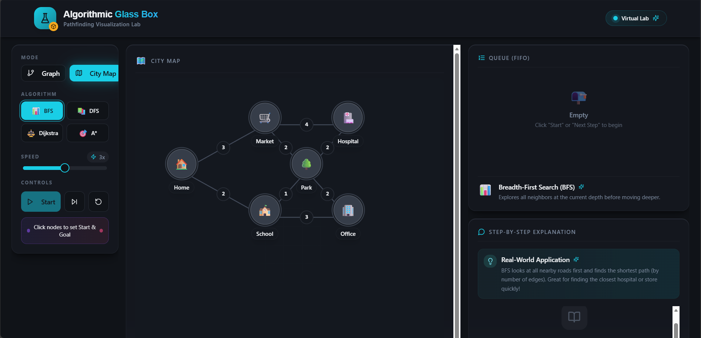
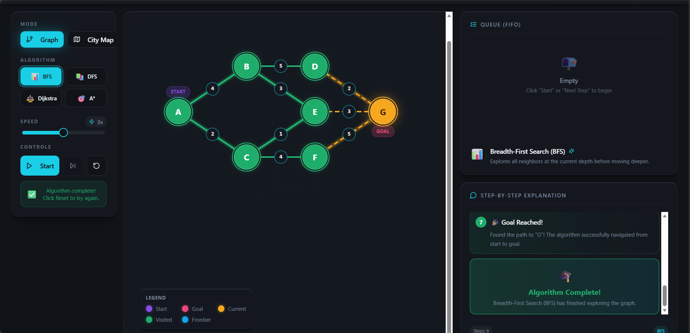
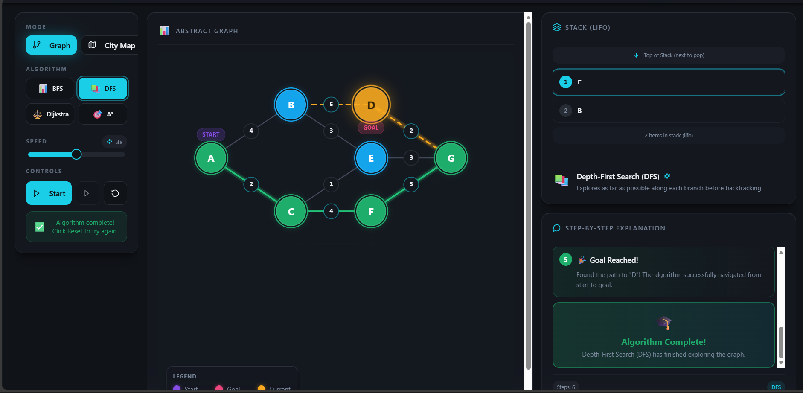
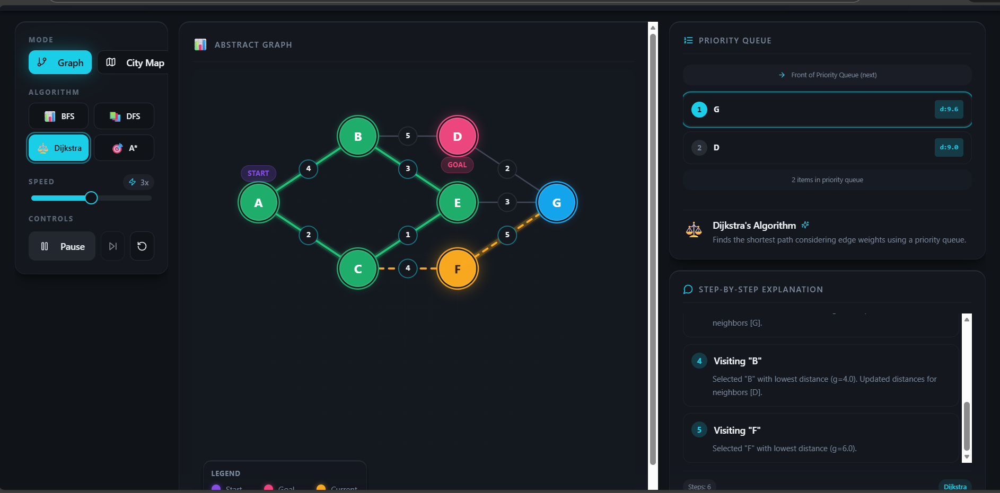
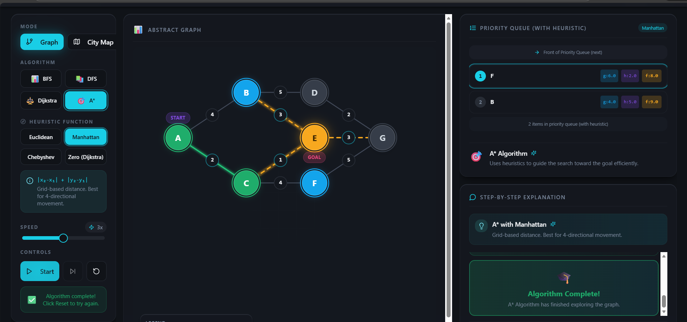

🧪 Algorithmic Glass Box by AlgoVista
 -------------------------------------

 

🌐 Live Demo: ([https://algovista-glassbox.vercel.app/](https://algovista-glassbox.vercel.app/))
🎥 Project Demo Video:  
👉 ([https://youtu.be/kO3Rj9uaetg](https://youtu.be/kO3Rj9uaetg))

Algorithmic Glass Box is an interactive virtual lab designed to make pathfinding algorithms transparent, visual, and intuitive.
Instead of treating algorithms as black boxes, this project lets users see every internal step — frontier updates, visited nodes, heuristics, and decision-making in real time.

📋 Table of Contents
------------------------

🧪 Algorithmic Glass Box by AlgoVista

🎯 Objective

✨ Core Features

🔍 Pathfinding Algorithms

🧠 Heuristic Functions

🎛️ Full Control Panel

🧩 Graph Modes

📊 Glass-Box Visualization

📖 Learning-First Design

🛠️ Tech Stack

🧪 Algorithm Capabilities Comparison

⚙️ How the Simulation Works

🚀 Local Setup

🌱 Future Scope

👥 Developer

📜 License

⭐ Final Thought

🎯 Objective
---------------
Pathfinding algorithms are critical in:

Navigation systems (Google Maps, GPS)

Robotics & AI

Games & simulations

Network routing

However, learners often struggle because algorithms are:

Abstract

Explained only with pseudocode

Hard to visualize dynamically

👉 Algorithmic Glass Box solves this by offering a step-by-step, glass-box view of how algorithms actually work.

✨ Core Features
  ----------------
🔍 Pathfinding Algorithms

BFS (Breadth-First Search)
Explores nodes level by level (unweighted graphs)

DFS (Depth-First Search)
Explores deeply before backtracking

Dijkstra’s Algorithm
Guarantees shortest path in weighted graphs

A*
Heuristic-guided optimal pathfinding

🧠 Heuristic Functions (Selectable)
--------------------------------------
Euclidean Distance

Manhattan Distance

Chebyshev Distance
(Supports diagonal movement – ideal for 8-directional grids)

Zero Heuristic (Dijkstra Mode)

Each heuristic dynamically affects how A* explores the graph.

🎛️ Full Control Panel
--------------------------
Algorithm selection

Graph mode switching

Heuristic selection

Speed control (real-time)

Start / Pause / Resume

Step-by-step execution

Reset simulation

🧩 Graph Modes
----------------------
Abstract Graph Mode
Node-edge representation for algorithm fundamentals

City Map Mode
Real-world inspired weighted graph

📊 Glass-Box Visualization
------------------------------
Clear legend for:

Start node

Goal node

Current node

Visited nodes

Frontier

Priority Queue (with heuristic values)

Live frontier updates

Path reconstruction after completion

📖 Learning-First Design
---------------------------------
Narration panel explains what the algorithm is doing

Data structure panel shows:

Queue / Stack / Priority Queue state

Designed as a virtual lab for students

🛠️ Tech Stack
------------------
| Technology             | Usage                       |
| ---------------------- | --------------------------- |
| **React + TypeScript** | Component-based UI & safety |
| **Vite**               | Fast development & builds   |
| **Tailwind CSS**       | Responsive, clean UI        |
| **Custom Hooks**       | Algorithm logic             |
| **Vercel**             | Production deployment       |

🧪 Algorithm Capabilities Comparison
---------------------------------------
| Algorithm | Weighted | Optimal | Heuristic |
| --------- | -------- | ------- | --------- |
| BFS       | ❌        | ✅       | ❌         |
| DFS       | ❌        | ❌       | ❌         |
| Dijkstra  | ✅        | ✅       | ❌         |
| A*        | ✅        | ✅       | ✅         |

⚙️ How the Simulation Works
------------------------------

User selects:

Graph mode

Algorithm

Heuristic

Start & goal nodes are chosen

Algorithm runs step-by-step

Each step updates:

Frontier

Visited nodes

Priority queue (if applicable)

Final path is reconstructed and displayed

This represents true algorithm execution, not pre-made animations.

🚀 Local Setup
--------------------
git clone[ https://github.com/AatifaRizvi/algorithmic-glass-box.git]( https://github.com/AatifaRizvi/algorithmic-glass-box.git)

cd pathfinding-lab-main

npm install

npm run dev

Open in browser:
👉 http://localhost:5173

🌱 Future Scope
------------------

Maze generation

User-drawn obstacles

Algorithm comparison mode

More heuristics

Mobile-first optimizations

Exportable step logs for learning

👥 Developer 
--------------

Team Name: AlgoVista
Project: Algorithmic Glass Box – Pathfinding Visualization Lab
Developer: Aatifa Rizvi

🔗 Live Demo: ([https://algovista-glassbox.vercel.app/
](https://algovista-glassbox.vercel.app/
))

📜 License
-------------

MIT License — free to use for learning, teaching, and experimentation.

⭐ Final Thought
-------------------

Algorithmic Glass Box turns algorithms into transparent systems,
helping learners move from confusion to clarity — one step at a time.

